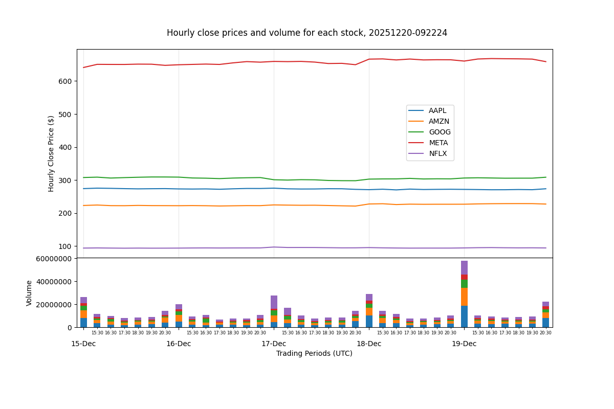

# Computer Infrastructure Assessment
This repository executes an automated data acquisition and visualisation pipeline 
for hourly FAANG stock price data using Python and GitHub Actions.

## Overview
This project demonstrates how automated workflows can be used to acquire, store, 
and visualise dynamic data using Python and GitHub Actions. 
It focuses on a reproducible data pipeline, basic financial data visualisation, and scheduled automation.

## Scope
- Downloads hourly stock prices, for the last 5 days, 
for the 5 FAANG companies listed on NASDAQ (META, AAPL, AMZN, NFLX, GOOG).  
- Stores data as a CSV file with a timestamped filename, then re-ingests and exports as a PNG plot.  
- The Python script [`faang.py`](https://github.com/SuColl/computer-infrastructure-assessment/blob/main/faang.py) 
performs all the above tasks.  
- The GitHub Action Workflow described in [`faang.yml`](https://github.com/SuColl/computer-infrastructure-assessment/blob/main/.github/workflows/faang.yml) automatically runs `faang.py` on Saturday mornings.  
- The Jupyter notebook [`problems.ipynb`](https://github.com/SuColl/computer-infrastructure-assessment/blob/main/problems.ipynb) 
breaks down and explains each part of the code, with additional analysis.

## Automation
A scheduled GitHub Actions workflow runs the data pipeline automatically each week, 
ensuring reproducible and up-to-date outputs without user intervention.  

## Data Source
Financial data is sourced from [`yfinance`](https://github.com/ranaroussi/yfinance), an open-source code 
library that allows Yahoo Finance's stock market data to be accessed via Python code. 

## Infrastructure Choices
This project can be executed locally, in GitHub Codespaces, or via GitHub Actions.
GitHub Actions is used for the scheduled execution because it provides a
cloud-based, reproducible, and maintenance-free environment compared to
local execution.

## Repository structure
```
├── .github/  
│   ├── workflows
│   ├── ├── faang.yml  
├── .gitignore 
├── data/ 
│   ├── 20251220-092224.csv  
│   ├── 20251220-200119.csv
├── plots/
│   ├── 20251220-200119.png 
│   ├── 20251220-092224.png 
├── faang.py
├── problems.ipynb  
├── README.md 
└── requirements.txt
```

## Python libraries used
- Python builtin modules
  - [datetime](https://docs.python.org/3/library/datetime.html) to handle date and time data
  - [os](https://docs.python.org/3/library/os.html) to interface with the operating system
  - [re](https://docs.python.org/3/library/re.html) to use regular expressions, used for string matching 
- Data manipulation
  - [NumPy](https://numpy.org/doc/stable/ ) Array manipulation 
  - [Pandas](https://pandas.pydata.org/docs/) Python Data Analysis Library
- Data Visualisation
  - [Matplotlib.PyPlot](https://matplotlib.org/stable/api/pyplot_summary.html) for plotting
- Data Acquisition
  - [yfinance](https://github.com/ranaroussi/yfinance) accessing financial data for these exercises


## How to Run Locally  
### Prerequisites
- Python 3.12 or higher
- Git

### Steps
- Clone the repository  
```git clone https://github.com/SuColl/computer-infrastructure-assessment.git```

- Install dependencies  
```pip install -r requirements.txt```

- Make the script executable  
```chmod u+x faang.py```

- Run the script  
```./faang.py```


## To Run in Github Codespaces
1. Sign up for a free GitHub account.
2. Go to the repository page in your browser.
3. Click the green Code button.
4. Click the Codespaces tab.
5. Click Create New Codespace on main.


## Expected output
```console
$ ./faang.py
[*********************100%***********************]  5 of 5 completed
Downloaded DataFrame Shape: 
 (35, 25)
Directory exists at data/
Current date and time are 2025-12-21 01:57:53.858452.
Generated CSV filename is 20251221-015753.csv.
Data written to data/20251221-015753.csv
Directory exists at data/
Directory data/ contains 25 files with appropriate filenames: the latest one is 20251221-015753.csv.
Read in: data/20251221-015753.csv
Plot created at plots/20251221-015753.png
```
After execution, a timestamped CSV file will appear in the `data/` directory 
and a corresponding PNG plot will be saved in the `plots/` directory.

## Sample output plot


## Limitations and Assumptions
- Data availability depends on the Yahoo Finance API
- Hourly data may be subject to API rate limits or market holidays
- No error handling is implemented for missing ticker data

## Project Provenance
This repository contains assessed work for the **Computer Infrastructure** module, part of the **Higher Diploma in Data Analytics** at **Atlantic Technological University, Ireland** (Autumn 2025).

**Author:** Susan Collins  

The assessment brief can be found here:  
[problems.md](https://github.com/ianmcloughlin/computer-infrastructure/blob/main/assessment/problems.md)
